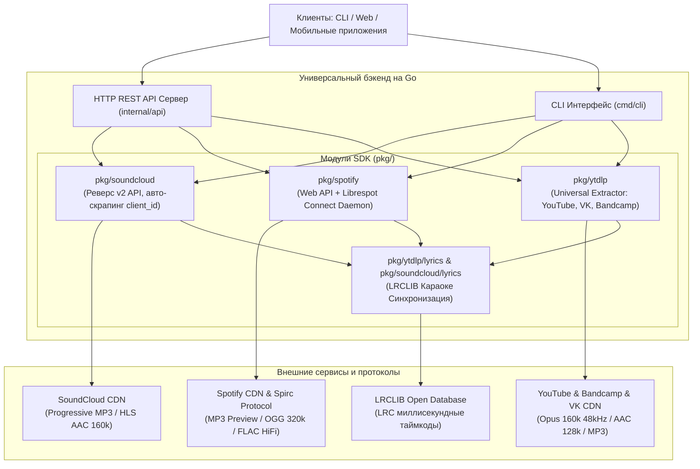

# Архивные заметки SDK: Universal Music Backend & Go SDK

> ⚠️ Этот файл сохраняет исторические примеры SDK и не является контрактом
> текущего Mixora HTTP API. Актуальные маршруты, авторизация и production
> ограничения описаны в [`README.md`](README.md) и
> [`../MIXORA_PROJECT_PLAN.md`](../MIXORA_PROJECT_PLAN.md). В частности,
> `/api/v1/extract`, YouTube, Bandcamp, VK и Spotify Connect control routes
> требуют Mixora cookie-сессию; HTTP API принимает только allowlist HTTPS URL
> YouTube, отдельных Bandcamp `/track/…` и публичных VK/VK Video media, а не
> «1000+ сайтов». Примеры ниже без cookie — архивные и не предназначены для
> копирования в production.

> **Проект:** Universal Music Backend & Go SDK  
> **Интегрированные сервисы:** SoundCloud v2, Spotify & Librespot Connect, Universal Media Extractor (`yt-dlp`: YouTube, YouTube Music, Bandcamp, VK и др.)  
> **Язык разработки:** Go (Golang 1.21+)  
> **Архитектура:** Модульная библиотека (SDK), автономный REST API сервер, кроссплатформенный CLI инструмент.

---

## Содержание

1. [Обзор архитектуры и принципы работы](#1-обзор-архитектуры-и-принципы-работы)
2. [Подробный анализ качеств и форматов звука](#2-подробный-анализ-качеств-и-форматов-звука)
3. [Движок текстов песен (Lyrics Engine)](#3-движок-текстов-песен-lyrics-engine)
4. [Руководство по CLI интерфейсу (`cmd/cli`)](#4-руководство-по-cli-интерфейсу-cmdcli)
5. [Справочник по REST API (`cmd/server`) с примерами `curl`](#5-справочник-по-rest-api-cmdserver-с-примерами-curl)
   - [5.1 Системные эндпоинты](#51-системные-эндпоинты)
   - [5.2 SoundCloud v2 API](#52-soundcloud-v2-api)
   - [5.3 Spotify & Librespot Connect API](#53-spotify--librespot-connect-api)
   - [5.4 Universal Extractor API (YouTube, VK, Bandcamp)](#54-universal-extractor-api-youtube-vk-bandcamp)
6. [Использование как Go SDK (Библиотека)](#6-использование-как-go-sdk-библиотека)
   - [6.1 SoundCloud SDK](#61-soundcloud-sdk)
   - [6.2 Spotify SDK](#62-spotify-sdk)
   - [6.3 Universal Extractor SDK](#63-universal-extractor-sdk)
7. [Установка, внешние зависимости и системные требования](#7-установка-внешние-зависимости-и-системные-требования)
8. [Устранение неполадок (Troubleshooting & FAQ)](#8-устранение-неполадок-troubleshooting--faq)

---

## 1. Обзор архитектуры и принципы работы

Проект решает фундаментальную задачу: **получение метаданных, прямых CDN аудиопотоков высокого качества и синхронизированных караоке-текстов песен из любых музыкальных источников через единый стандартизированный API и интерфейс**.



### Структура пакетов в репозитории:

* **`cmd/server/`** — главный исполняемый файл автономного микросервиса REST API. Инициализирует все 3 клиента, проверяет наличие `yt-dlp` и демона Spotify Connect (`go-librespot`), поднимает сервер с поддержкой CORS и логирования.
* **`cmd/cli/`** — консольный инструмент для терминала (`music-cli`). Позволяет мгновенно получать метаданные, прямые ссылки на аудио в максимальном качестве и тексты песен.
* **`internal/api/`** — HTTP-обработчики (эндпоинты), роутер и сериализация ошибок/ответов.
* **`pkg/soundcloud/`** — независимый Go SDK для SoundCloud.
  * `client.go`: инициализация, автоматический парсинг HTML soundcloud.com и извлечение актуального `client_id` из бандлов JavaScript без ключей разработчика.
  * `tracks.go`: разрешение URL в ID, получение треков, чартов, плейлистов.
  * `stream.go`: парсинг медиа-транскодингов, получение прямых подписанных ссылок AWS CloudFront/CDN (`all_formats`).
  * `lyrics.go`: интеграция с базой текстов LRCLIB.
  * `waveform.go`: загрузка сэмплов амплитуд трека для отрисовки аудиоволны.
* **`pkg/spotify/`** — независимый Go SDK для Spotify & Librespot.
  * `client.go`: гибридный клиент. Умеет работать без API ключей (Zero-Config) через официальные открытые метаданные и Web API.
  * `connect.go`: HTTP клиент к локальному демону Spotify Connect (Spirc протокол) для полноценного стриминга полного трека (OGG Vorbis 320 kbps / FLAC).
  * `supervisor.go`: контроль жизненного цикла процесса `go-librespot` в системе.
  * `lyrics.go`: получение караоке-текстов песен с таймкодами.
* **`pkg/ytdlp/`** — универсальный обёрточный SDK вокруг движка `yt-dlp`.
  * `client.go`: проверка наличия бинарника `yt-dlp`, запуск с контролем контекста и таймаутов.
  * `extract.go`: извлечение всех форматов и аудиодорожек с сортировкой по битрейту (`AvailableQualities`).
  * `search.go`: поиск по YouTube Music без использования квот Google API.
  * `lyrics.go`: нормализация названий треков и авто-подтягивание текстов.

---

## 2. Подробный анализ качеств и форматов звука

Проект полностью структурирует форматы аудио, предоставляя клиенту исчерпывающую информацию: используемый кодек, расширение файла, битрейт, частоту дискретизации и прямой протокол воспроизведения.

### 2.1 Сводная матрица форматов

| Формат / Кодек | Контейнер | Битрейт | Частота дискретизации | Доступность в сервисах | Описание и применение |
| :--- | :--- | :--- | :--- | :--- | :--- |
| **FLAC** (Free Lossless Audio Codec) | `.flac` | Lossless (~800–1411 kbps) | 44.1 kHz / 16–24 bit | **Bandcamp** (покупка/скачивание), **Spotify Connect** (HiFi) | Звук студийного качества без потерь (Bit-perfect). Идеален для аудиофилов и архивации. |
| **WAV** (PCM Audio) | `.wav` | Несжатый (~1411 kbps) | 44.1–96 kHz / 24 bit | **Bandcamp**, **SoundCloud** (original download) | Исходный несжатый мастер-файл трека от продюсера/автора. |
| **Opus** | `.webm` | **160 kbps** (HQ), 70 kbps, 50 kbps | **48000 Hz (48 kHz)** | **YouTube** / **YouTube Music** (`itag 251`), **SoundCloud** | Самый совершенный аудиокодек в мире. При 160 kbps превосходит MP3 320 kbps по прозрачности высоких частот. |
| **AAC** (Advanced Audio Coding) | `.m4a` / `.mp4` | **160 kbps** (HQ), **128 kbps**, 96 kbps, 49 kbps | 44.1 kHz / 22.05 kHz | **SoundCloud** (HLS `aac_160k`), **YouTube** (`itag 140`), **Bandcamp** | Стандарт индустрии Apple/Web. Отличная энергоэффективность при декодировании на мобильных устройствах. |
| **MP3** (MPEG Audio Layer III) | `.mp3` | **320 kbps** (HQ), **160 kbps**, **128 kbps**, 96 kbps | 44.1 kHz | **SoundCloud** (Progressive/HLS), **Spotify Preview**, **VK**, **Bandcamp** | Максимальная совместимость с любыми старыми плеерами, автомобильными магнитолами и браузерами. |
| **OGG Vorbis** | `.ogg` | **320 kbps** (Very High), **160 kbps** (High), **96 kbps** (Normal) | 44.1 kHz | **Spotify Connect** (полный стриминг) | Основной стриминговый формат Spotify через протокол Spirc. |

### 2.2 Специфика стриминга по сервисам

#### SoundCloud:
SoundCloud транскодирует каждый загруженный трек в несколько профилей (Transcodings):
1. **`aac_160k`** (HLS): `audio/mp4; codecs="mp4a.40.2"`, 160 kbps HQ — наилучшее качество звука в SoundCloud.
2. **`mp3_1_0`** (Progressive): прямой непрерывный HTTP MP3 поток 128 kbps. Идеален для быстрого старта без HLS-плеера.
3. **`mp3_1_0`** / **`abr_sq`** (HLS): MP3 128 kbps с адаптивным стримингом по сегментам.
4. **`aac_96k`** (HLS): экономный поток 96 kbps для медленного мобильного интернета.

#### Spotify:
1. **Direct Preview Stream (Без авторизации)**: прямая ссылка на MP3 файл 96–160 kbps с CDN (`https://p.scdn.co/mp3-preview/...`). Работает мгновенно для ознакомления и встраивания.
2. **Spotify Connect (Полные треки)**: через открытый порт демона `librespot` передается команда на воспроизведение любого трека в качестве OGG Vorbis 320 kbps или Lossless FLAC.

#### YouTube / YouTube Music:
Благодаря обходу `n-sig` в `yt-dlp`, из видеопотока вырезается чистый аудиопоток без видеокадров:
1. `itag 251`: **WebM Opus 160 kbps @ 48000 Hz** (Студийное качество, полный динамический диапазон).
2. `itag 140`: **M4A AAC 128 kbps @ 44100 Hz** (Стабильный поток для iOS/Safari).
3. `itag 250 / 249`: Opus 70 kbps и 50 kbps (ультра-сжатие).

---

## 3. Движок текстов песен (Lyrics Engine)

Проект оснащен модулем автоматического поиска и синхронизации текстов песен.

### 3.1 Формат синхронизированного текста (LRC)
Каждая строка текста связывается с временным штампом начала строки в миллисекундах:
```text
[00:12.29] Горы дыма, горы дыма в стакане тают
[00:16.36] Красота ее небесная
[00:18.72] Моя милая, моя милая замирает
[00:22.53] Без тебя вокруг все стало пресно
```

### 3.2 Алгоритм очистки названий (Title Normalizer)
На YouTube и SoundCloud авторы часто добавляют в заголовок лишнюю информацию:
* Исходное название: `XOLIDAYBOY - Мания (Official Video 2023) [Prod. by ...] 4K`
* Алгоритм в `pkg/ytdlp/lyrics.go`:
  1. Вырезает суффиксы `(Official Video)`, `[Clip]`, `4K`, `Remastered`, `Lyric Video`.
  2. Разделяет исполнителя и название по разделителям `-`, `—`, `|`.
  3. Удаляет скобки `(...)`, `[...]`.
  4. Выполняет нечеткий поиск в базе LRCLIB по очищенной паре `artist="XOLIDAYBOY"` и `track="Мания"`.
  5. Возвращает готовые структуры `[]LyricLine` с точными миллисекундами (`TimeMs`) и сырой текст `SyncedLyrics` / `PlainLyrics`.

---

## 4. Руководство по CLI интерфейсу (`cmd/cli`)

Сборка CLI утилиты:
```bash
go build -o music-cli ./cmd/cli
```

### 4.1 Команды SoundCloud

```bash
# Получить прямую аудио-ссылку и список ВСЕХ доступных форматов (AAC 160k, MP3 128k, AAC 96k)
./music-cli stream "https://soundcloud.com/xolidayboy-sc/maniya"

# Вывести синхронизированный караоке-текст песни с миллисекундами
./music-cli lyrics "https://soundcloud.com/xolidayboy-sc/maniya"

# Разрешить любой URL SoundCloud в подробный JSON объект
./music-cli resolve "https://soundcloud.com/xolidayboy-sc/maniya"

# Поиск треков по каталогу
./music-cli search "xolidayboy"

# Получить сэмплы звуковой волны (Waveform) для визуализатора
./music-cli waveform "https://soundcloud.com/xolidayboy-sc/maniya"

# Чарты и популярное по жанрам (all-music, hiphoprap, electronic, rock)
./music-cli trending all-music
```

### 4.2 Команды Spotify & Librespot

```bash
# Проверить трек, метаданные, тиры качества и прямую ссылку на MP3 preview
./music-cli spotify stream "5oRa6OeJGfi01blkO2WSWl"

# Получить синхронизированный текст песни из Spotify
./music-cli spotify lyrics "5oRa6OeJGfi01blkO2WSWl"

# Разрешить ссылку Spotify на альбом, плейлист или трек
./music-cli spotify resolve "https://open.spotify.com/track/5oRa6OeJGfi01blkO2WSWl"

# Поиск в каталоге Spotify
./music-cli spotify search "Xolidayboy Мания"

# Получить треклист альбома
./music-cli spotify album "album_id_or_url"

# Управление воспроизведением через Spotify Connect (при запущенном go-librespot)
./music-cli spotify connect status
./music-cli spotify connect play "spotify:track:5oRa6OeJGfi01blkO2WSWl"
./music-cli spotify connect pause
./music-cli spotify connect next
./music-cli spotify connect volume 75
```

### 4.3 Команды Universal Extractor (YouTube, Bandcamp, VK)

```bash
# Извлечь трек по любой ссылке (YouTube, Bandcamp, VK) со всеми качествами и текстом
./music-cli extract "https://www.youtube.com/watch?v=CiOZ90sDmik"

# Быстрый поиск треков на YouTube
./music-cli yt search "Xolidayboy Мания"

# Получение прямой ссылки на аудиопоток YouTube (Opus 160k / AAC 128k)
./music-cli yt stream "CiOZ90sDmik"

# Извлечение трека из Bandcamp
./music-cli bc "https://artist.bandcamp.com/track/song-name"

# Извлечение трека из VK
./music-cli vk "https://vk.com/audio..."
```

---

## 5. Справочник по REST API (`cmd/server`) с примерами `curl`

Запуск сервера на порту 8080:
```bash
go run ./cmd/server -port=8080
```

### Флаги запуска сервера:
* `-port`: TCP порт сервера (по умолчанию `8080`).
* `-client-id`: Client ID для SoundCloud (необязательно, при отсутствии автоматически скрапится из JS-бандлов).
* `-spotify-connect-url`: URL локального REST API демона `go-librespot` (по умолчанию `http://127.0.0.1:24879`).
* `-spotify-auto-daemon`: флаг (`true`/`false`) автоматического запуска демона Spotify Connect при обнаружении бинарника.
* `-spotify-device-name`: сетевое имя устройства в приложении Spotify (по умолчанию `"SoundCloud-Spotify-Go"`).

---

### 5.1 Системные эндпоинты

#### Проверка статуса (Healthcheck)
```bash
curl -X GET http://localhost:8080/health
```
**Ответ `200 OK`:**
```json
{
  "status": "ok",
  "service": "universal-music-backend",
  "soundcloud": true,
  "spotify": true,
  "ytdlp": true
}
```

---

### 5.2 SoundCloud v2 API

#### 1. Разрешение URL (Resolve)
Преобразует любую публичную ссылку SoundCloud в полноценный JSON объект трека или плейлиста.
```bash
curl -X GET "http://localhost:8080/api/v1/resolve?url=https://soundcloud.com/xolidayboy-sc/maniya"
```
**Ответ `200 OK`:**
```json
{
  "id": 1500947098,
  "title": "Мания",
  "duration": 191276,
  "permalink_url": "https://soundcloud.com/xolidayboy-sc/maniya",
  "user": {
    "id": 1058223637,
    "username": "XOLIDAYBOY"
  },
  "artwork_url": "https://i1.sndcdn.com/artworks-67FpU4Y-t500x500.jpg",
  "playback_count": 854200
}
```

#### 2. Получение прямой ссылки и всех форматов стриминга (Stream & Qualities)
Возвращает лучшую прямую ссылку на воспроизведение и массив всех доступных профилей транскодирования (AAC 160k, MP3 128k, AAC 96k).
```bash
curl -X GET "http://localhost:8080/api/v1/tracks/1500947098/stream"
```
**Ответ `200 OK`:**
```json
{
  "track_id": 1500947098,
  "title": "Мания",
  "format": "progressive",
  "stream_url": "https://cf-media.sndcdn.com/baFEWyvWAQWV.128.mp3?Policy=...&Signature=...",
  "duration": 191276,
  "all_formats": [
    {
      "preset": "aac_160k",
      "protocol": "hls",
      "mime_type": "audio/mp4; codecs=\"mp4a.40.2\"",
      "quality": "sq",
      "codec": "aac",
      "bitrate": "160 kbps (HQ)",
      "url": "https://playback.media-streaming.soundcloud.cloud/.../playlist.m3u8?..."
    },
    {
      "preset": "mp3_1_0",
      "protocol": "progressive",
      "mime_type": "audio/mpeg",
      "quality": "sq",
      "codec": "mp3",
      "bitrate": "128 kbps",
      "url": "https://cf-media.sndcdn.com/baFEWyvWAQWV.128.mp3?..."
    },
    {
      "preset": "aac_96k",
      "protocol": "hls",
      "mime_type": "audio/mp4; codecs=\"mp4a.40.2\"",
      "quality": "lq",
      "codec": "aac",
      "bitrate": "96 kbps",
      "url": "https://playback.media-streaming.soundcloud.cloud/.../playlist.m3u8?..."
    }
  ]
}
```

#### 3. Получение синхронизированного текста песни (Lyrics)
```bash
curl -X GET "http://localhost:8080/api/v1/tracks/1500947098/lyrics"
```
**Ответ `200 OK`:**
```json
{
  "track_id": 1500947098,
  "track_title": "Мания",
  "artist_name": "Xolidayboy",
  "source": "lrclib",
  "synced_lyrics": "[00:12.29] Горы дыма, горы дыма в стакане тают\n[00:16.36] Красота ее небесная\n...",
  "plain_lyrics": "Горы дыма, горы дыма в стакане тают\nКрасота ее небесная\n..."
}
```

#### 4. Получение амплитуд звуковой волны (Waveform)
```bash
curl -X GET "http://localhost:8080/api/v1/tracks/1500947098/waveform"
```
**Ответ `200 OK`:**
```json
{
  "width": 1800,
  "height": 140,
  "samples": [0, 4, 12, 45, 89, 120, 110, 95, 78, 45, 12, ...]
}
```

#### 5. Поиск треков (Search)
```bash
curl -X GET "http://localhost:8080/api/v1/search?q=xolidayboy&type=tracks&limit=3"
```

#### 6. Чарты и популярные треки (Charts / Trending)
```bash
curl -X GET "http://localhost:8080/api/v1/charts/trending?genre=all-music&limit=10"
```

---

### 5.3 Spotify & Librespot Connect API

#### 1. Метаданные трека и прямая ссылка на MP3 превью
```bash
curl -X GET "http://localhost:8080/api/v1/spotify/tracks/5oRa6OeJGfi01blkO2WSWl"
```
**Ответ `200 OK`:**
```json
{
  "id": "5oRa6OeJGfi01blkO2WSWl",
  "title": "Мания",
  "artists": [
    {
      "id": "2Z0kQWf5s05Lq205vRsp2t",
      "name": "Xolidayboy"
    }
  ],
  "album": {
    "name": "Мания"
  },
  "duration_ms": 191201,
  "preview_url": "https://p.scdn.co/mp3-preview/69618bae74ece641665023be5e5aa117ba043f9e",
  "uri": "spotify:track:5oRa6OeJGfi01blkO2WSWl",
  "external_url": "https://open.spotify.com/track/5oRa6OeJGfi01blkO2WSWl"
}
```

#### 2. Стриминговые опции и доступные тиры качества Spotify
```bash
curl -X GET "http://localhost:8080/api/v1/spotify/tracks/5oRa6OeJGfi01blkO2WSWl/stream"
```
**Ответ `200 OK`:**
```json
{
  "track_id": "5oRa6OeJGfi01blkO2WSWl",
  "uri": "spotify:track:5oRa6OeJGfi01blkO2WSWl",
  "title": "Мания",
  "artists": "[Xolidayboy]",
  "duration_ms": 191201,
  "preview_url": "https://p.scdn.co/mp3-preview/69618bae74ece641665023be5e5aa117ba043f9e",
  "connect_available": false,
  "available_qualities": [
    {
      "name": "MP3 96-160 kbps (Direct Preview)",
      "codec": "mp3",
      "bitrate": "160 kbps",
      "available": true,
      "type": "direct_preview",
      "url": "https://p.scdn.co/mp3-preview/69618bae74ece641665023be5e5aa117ba043f9e"
    },
    {
      "name": "OGG Vorbis Very High (320 kbps)",
      "codec": "vorbis",
      "bitrate": "320 kbps",
      "available": false,
      "type": "spotify_connect"
    },
    {
      "name": "OGG Vorbis High (160 kbps)",
      "codec": "vorbis",
      "bitrate": "160 kbps",
      "available": false,
      "type": "spotify_connect"
    },
    {
      "name": "FLAC HiFi (Lossless Audio)",
      "codec": "flac",
      "bitrate": "Lossless",
      "available": false,
      "type": "spotify_connect"
    }
  ]
}
```

#### 3. Синхронизированный текст песни из Spotify
```bash
curl -X GET "http://localhost:8080/api/v1/spotify/tracks/5oRa6OeJGfi01blkO2WSWl/lyrics"
```
**Ответ `200 OK`:**
```json
{
  "track_name": "Мания",
  "artist": "Xolidayboy",
  "source": "LRCLIB",
  "synced": true,
  "lines": [
    {
      "time_ms": 12290,
      "text": "Горы дыма, горы дыма в стакане тают"
    },
    {
      "time_ms": 16360,
      "text": "Красота ее небесная"
    }
  ],
  "plain": "Горы дыма, горы дыма в стакане тают\nКрасота ее небесная..."
}
```

#### 4. Статус и управление Spotify Connect Player
```bash
# Получить статус плеера в реальном времени
curl -X GET http://localhost:8080/api/v1/spotify/connect/status

# Запустить воспроизведение трека на устройстве
curl -X POST http://localhost:8080/api/v1/spotify/connect/player/play \
  -H "Content-Type: application/json" \
  -d '{"uri":"spotify:track:5oRa6OeJGfi01blkO2WSWl"}'

# Пауза
curl -X POST http://localhost:8080/api/v1/spotify/connect/player/pause

# Следующий трек
curl -X POST http://localhost:8080/api/v1/spotify/connect/player/next

# Изменить громкость (0-100)
curl -X POST http://localhost:8080/api/v1/spotify/connect/player/volume \
  -H "Content-Type: application/json" \
  -d '{"volume":80}'
```

---

### 5.4 Архивный Universal Extractor API (YouTube, VK, Bandcamp)

#### 1. Извлечение разрешённого медиа (`/api/v1/extract`)
Текущий Mixora HTTP API принимает только авторизованный запрос с allowlist URL:
YouTube/YouTube Music video, Bandcamp `/track/…` или публичная VK/VK Video
media-страница. Формат, bitrate и доступность медиа определяет провайдер;
краткоживущая media-ссылка не является persistent contract.

```bash
curl -X GET "http://localhost:8080/api/v1/extract?url=https://www.youtube.com/watch?v=CiOZ90sDmik"
```
**Ответ `200 OK`:**
```json
{
  "id": "CiOZ90sDmik",
  "title": "XOLIDAYBOY - Мания (Официальный клип 2023)",
  "artist": "XOLIDAYBOY",
  "uploader": "XOLIDAYBOY",
  "duration": 190.264,
  "thumbnail": "https://i.ytimg.com/vi/CiOZ90sDmik/maxresdefault.jpg",
  "webpage_url": "https://www.youtube.com/watch?v=CiOZ90sDmik",
  "extractor": "youtube",
  "audio_url": "https://rr3---sn-nu5goxu-3p8s.googlevideo.com/videoplayback?...",
  "audio_format": "webm",
  "bitrate": 160.0,
  "available_qualities": [
    {
      "format_id": "251",
      "name": "Opus 160 kbps (Studio High Quality)",
      "codec": "opus",
      "bitrate": 160.0,
      "sample_rate": 48000,
      "extension": "webm",
      "url": "https://rr3---sn-nu5goxu-3p8s.googlevideo.com/videoplayback?..."
    },
    {
      "format_id": "140",
      "name": "AAC 128 kbps (High Quality)",
      "codec": "aac",
      "bitrate": 128.0,
      "sample_rate": 44100,
      "extension": "m4a",
      "url": "https://rr3---sn-nu5goxu-3p8s.googlevideo.com/videoplayback?..."
    },
    {
      "format_id": "250",
      "name": "Opus 70 kbps",
      "codec": "opus",
      "bitrate": 70.0,
      "sample_rate": 48000,
      "extension": "webm",
      "url": "https://rr3---sn-nu5goxu-3p8s.googlevideo.com/videoplayback?..."
    }
  ],
  "lyrics": {
    "track_name": "Мания",
    "artist": "Xolidayboy",
    "source": "LRCLIB",
    "synced": true,
    "lines": [
      {
        "time_ms": 12290,
        "text": "Горы дыма, горы дыма в стакане тают"
      },
      {
        "time_ms": 16360,
        "text": "Красота ее небесная"
      }
    ]
  }
}
```

#### 2. Поиск по YouTube
```bash
curl -X GET "http://localhost:8080/api/v1/youtube/search?q=xolidayboy+мания&limit=5"
```

#### 3. Быстрое извлечение прямой ссылки на звук YouTube
```bash
curl -X GET "http://localhost:8080/api/v1/youtube/stream?url=https://www.youtube.com/watch?v=CiOZ90sDmik"
```
**Ответ `200 OK`:**
```json
{
  "url": "https://www.youtube.com/watch?v=CiOZ90sDmik",
  "audio_url": "https://rr3---sn-nu5goxu-3p8s.googlevideo.com/videoplayback?..."
}
```

---

## 6. Использование как Go SDK (Библиотека)

Пакеты можно использовать независимо в любом вашем Go-приложении.

### 6.1 SoundCloud SDK

```go
package main

import (
	"context"
	"fmt"
	"log"
	"time"

	"github.com/iulian/soundcloud-go/pkg/soundcloud"
)

func main() {
	ctx, cancel := context.WithTimeout(context.Background(), 10*time.Second)
	defer cancel()

	// Инициализация (client_id парсится автоматически без ключей разработчика)
	client, err := soundcloud.New(ctx)
	if err != nil {
		log.Fatalf("Ошибка создания клиента: %v", err)
	}

	// 1. Разрешение ссылки на трек
	track, err := client.ResolveTrack(ctx, "https://soundcloud.com/xolidayboy-sc/maniya")
	if err != nil {
		log.Fatalf("Ошибка разрешения трека: %v", err)
	}
	fmt.Printf("Трек: %s | Автор: %s | ID: %d\n", track.Title, track.User.Username, track.ID)

	// 2. Получение всех форматов звука (AAC 160k, MP3 128k и т.д.)
	formats := client.GetAllStreamFormats(ctx, track)
	for i, f := range formats {
		fmt.Printf("%d. [%s] %s %s -> %s\n", i+1, f.Quality, f.Codec, f.Bitrate, f.URL)
	}

	// 3. Получение синхронизированного текста
	lyrics, err := client.GetTrackLyrics(ctx, track)
	if err == nil && lyrics.SyncedLyrics != "" {
		fmt.Println("Синхронизированный текст:\n", lyrics.SyncedLyrics)
	}
}
```

---

### 6.2 Spotify SDK

```go
package main

import (
	"context"
	"fmt"
	"log"
	"time"

	"github.com/iulian/soundcloud-go/pkg/spotify"
)

func main() {
	ctx, cancel := context.WithTimeout(context.Background(), 10*time.Second)
	defer cancel()

	// Создание клиента (Zero-Config)
	client, err := spotify.New(ctx)
	if err != nil {
		log.Fatalf("Ошибка создания Spotify клиента: %v", err)
	}

	// Получение метаданных и опций стриминга
	streamInfo, err := client.GetStream(ctx, "5oRa6OeJGfi01blkO2WSWl")
	if err != nil {
		log.Fatalf("Ошибка стрима: %v", err)
	}

	fmt.Printf("Трек: %s (%s)\n", streamInfo.Title, streamInfo.Artists)
	fmt.Printf("Прямое MP3 Превью: %s\n", streamInfo.PreviewURL)

	for _, q := range streamInfo.AvailableQualities {
		fmt.Printf("Качество: %s [%s] - Доступно: %v\n", q.Name, q.Bitrate, q.Available)
	}

	// Получение караоке-текста
	lyrics, err := client.GetTrackLyrics(ctx, "5oRa6OeJGfi01blkO2WSWl")
	if err == nil && lyrics.Synced {
		for _, line := range lyrics.Lines {
			fmt.Printf("[%d ms] %s\n", line.TimeMs, line.Text)
		}
	}
}
```

---

### 6.3 Universal Extractor SDK

```go
package main

import (
	"context"
	"fmt"
	"log"
	"time"

	"github.com/iulian/soundcloud-go/pkg/ytdlp"
)

func main() {
	ctx, cancel := context.WithTimeout(context.Background(), 20*time.Second)
	defer cancel()

	extractor := ytdlp.New()
	if !extractor.IsInstalled() {
		log.Fatal("yt-dlp не найден в PATH")
	}

	// Извлечение любого URL (YouTube, Bandcamp, VK и др.)
	media, err := extractor.Extract(ctx, "https://www.youtube.com/watch?v=CiOZ90sDmik")
	if err != nil {
		log.Fatalf("Ошибка извлечения: %v", err)
	}

	fmt.Printf("Источник: %s | Название: %s | Длина: %.1f сек\n", media.Extractor, media.Title, media.Duration)
	fmt.Printf("Лучший аудиопоток: %s (%s @ %.0f kbps)\n", media.AudioURL, media.AudioFormat, media.Bitrate)

	// Все доступные дорожки звука
	fmt.Println("Доступные дорожки:")
	for _, q := range media.AvailableQualities {
		fmt.Printf("- %s (Кодек: %s, Сэмплы: %d Hz)\n", q.Name, q.Codec, q.SampleRate)
	}
}
```

---

## 7. Установка, внешние зависимости и системные требования

### Минимальные требования:
1. **Go**: версия `1.21` или новее.
2. **`yt-dlp`**: требуется для работы универсального экстрактора (YouTube, Bandcamp, VK).
   * **macOS**: `brew install yt-dlp`
   * **Ubuntu/Debian**: `sudo apt install yt-dlp` или `sudo wget https://github.com/yt-dlp/yt-dlp/releases/latest/download/yt-dlp -O /usr/local/bin/yt-dlp && sudo chmod a+rx /usr/local/bin/yt-dlp`
   * **Windows**: `winget install yt-dlp`
3. **`ffmpeg`**: рекомендуется для быстрой сборки и конвертации форматов потоков на лету.
   * `brew install ffmpeg` / `sudo apt install ffmpeg`
4. **`go-librespot`** *(опционально)*: требуется только если необходимо транслировать полные треки Spotify на колонки в OGG Vorbis 320 kbps / FLAC.
   * `brew install go-librespot`

---

## 8. Устранение неполадок (Troubleshooting & FAQ)

### Q1: Нужно ли регистрировать аккаунты разработчика в SoundCloud или Spotify?
**Нет.** 
* Модуль **SoundCloud** автоматически парсит домашнюю страницу SoundCloud, находит ссылки на последние клиентские JavaScript файлы и регулярным выражением вытаскивает рабочий ключ `client_id`. Если ключ истекает, он автоматически обновляется.
* Модуль **Spotify** использует открытые шлюзы метаданных и прямые CDN превью. Для воспроизведения полных треков используется протокол Spotify Connect (требуется Premium аккаунт для Connect).

### Q2: Замедляет ли YouTube отдачу звука (n-sig challenge)?
**Нет.** Интегрированный `yt-dlp` автоматически решает JS-челленджи шифрования ссылок (`n-sig` деобфускация), поэтому потоки отдаются на максимальной скорости вашего интернет-канала.

### Q3: Как получить FLAC или WAV через проект?
1. В **Bandcamp**: треки, купленные или доступные бесплатно, имеют прямые ссылки на скачивание в форматах FLAC/WAV.
2. В **SoundCloud**: если автор трека включил опцию *"Enable Direct Downloads"*, эндпоинт `/api/v1/tracks/{id}/download` возвращает оригинальный мастер-файл (WAV или исходный MP3 320k).
3. В **Spotify Connect**: выбрав профиль Lossless, демон получает FLAC стрим напрямую с серверов Spotify.

### Q4: Почему в некоторых песнях нет текста?
Если трек редкий или неофициальный ремикс, база LRCLIB может не иметь текста. Модуль возвращает статус `404` или пустой объект без сбоя основного аудио-потока.
